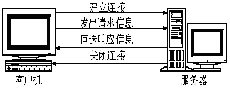
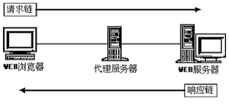
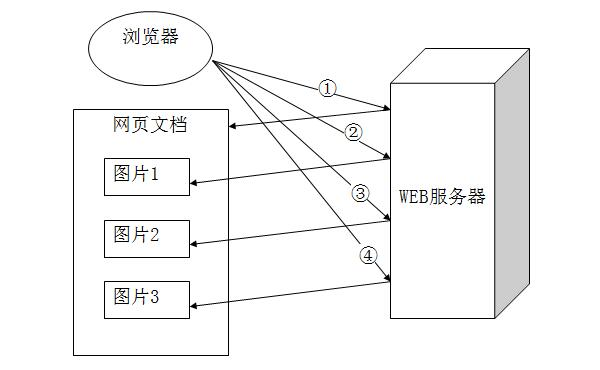
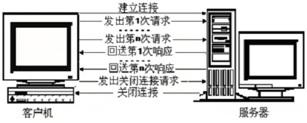
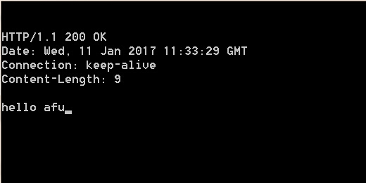

### HTTP简介

+ WEB 浏览器与 WEB 服务器之间的一问一答的交互过程必须遵循一定的规则 这个规则就是 HTTP 协议

+ HTTP 是 hypertext transfer protocol ( 超文本传输协议 ) 的简写 它是 TCP/IP  协议集中的一个应用层协议 用于定义 WEB 浏览器与 WEB 服务器之间交换数据的过程以及数据本身的格式

+ HTTP 协议的版本 HTTP/1.0, HTTP/1.1, HTTP/2.0

### HTTP 1.0 的会话方式

+ 四个步骤



+ 浏览器与 WEB 服务器的连接过程是短暂的 每次连接只处理一个请求和响应。对每一个页面的访问 浏览器与 WEB 服务器都要建立一次单独的连接

+ 浏览器到 WEB 服务器之间的所有通讯都是完全独立分开的请求和响应对



### 浏览器访问多图网页的过程



### HTTP 1.1 的特点



+ 在一个 TCP 连接上可以传送多个 HTTP 请求和响应

+ 多个请求和响应过程可以重叠进行

+ 增加了更多的请求头和响应头

### HTTP 消息概述

<pre>
                               |--> 请求行
               |--> 请求消息 --|--> 消息头
               |               |--> 实体内容
HTTP Message --|
               |               |--> 状态行
               |--> 响应消息 --|--> 消息头
                               |--> 实体内容
</pre>

### HTTP 请求消息

+ 请求消息的结构

一个请求行、若干消息头、以及实体内容。其中的一些消息头和实体内容都是可选的 **消息头和实体内容之间用空行隔开**

+ 举例

<pre>
GET / HTTP/1.1                      <-- 请求行
Accept: */*                         <--
Accept-Language: en-us                 |
Connection: Keep-Alive                 |
Host: localhost                        | 消息头
Content-Length: 0                      |
User-Agent: Mozilla/4.0                |
Accept-Encoding: gzip, deflate      <--
< empty line >                      <-- 一个空行
</pre>

### HTTP 响应消息

+ 响应消息的结构

一个状态行、若干消息头、以及实体内容。其中的一些消息头和实体内容都是可选的 **消息头和实体内容之间用空行隔开**

+ 举例

<pre>
HTTP/1.1 200 OK                         <-- 状态行
Server: Microsoft-IIS/5.0               <--
Date: Thu, 13 Jul 2000 05:46:53 GMT        |
Content-Length: 2291                       | 消息头
Content-Type: text/html                    | 
Cache-control: private                  <--
< empty line >                          <-- 一个空行
data from server ...                    <-- 实体内容
</pre>

### HTTP 消息 补充细节

+ 响应消息的实体内容就是网页文件的内容 也就是在浏览器中使用查看源文件的方式所看到的内容

+ 一个使用 GET 方式的请求消息中不能包含实体内容 只有使用 POST、PUT 和 DELETE 方式的请求消息中才可以包含实体内容

+ 对于 HTTP 1.1 来说 如果 HTTP 请求或响应消息中包括实体内容 且没有采用 chunked 传输编码方式 那么消息头部分必须包含内容长度的字段 否则 客户和服务程序就无法知道实体内容何时结束

### HTTP 请求行与状态行

+ 请求行

    - 格式： 请求方式 资源路径 HTTP版本号< CRLF >
  
    - eg. GET /index.html HTTP/1.1
  
    - 请求方式举例： POST HEAD OPTIONS DELETE TRACE PUT

+ 状态行

    - 格式： HTTP版本号 状态码 原因叙述< CRLF >
  
    - eg. HTTP/1.1 200 OK

### HTTP 消息头

+ 消息头分为

    - 通用消息头、请求头、响应头、实体头
  
    - 既可用在请求消息中 也可用在响应消息中的消息头叫做通用消息头 其他类似

+ 使用消息头 可以实现 HTTP 客户机与服务器之间的条件请求和应答 消息头相当于服务器和浏览器之间的一些暗号指令

+ 消息头格式

    - 一个头字段名称 然后依次是冒号、空格、值、回车和换行符 eg. Accept-Language: en-us< CRLF >

+ 消息头字段名是不区分大小写的 但习惯上将每个单词的第一个字母大写

+ 整个消息头部分中的各行消息头顺序可任意排列

+ 许多请求头字段都允许客户端在值部分指定多个可接受的选项 多个项之间以逗号分隔

    - Accept-Encoding: gzip, compress

+ 有些头字段可以出现多次 例如 响应消息中可以包含有多个 Warning 字段

### 使用 telnet 模拟 get 请求



```javascript
假设我们使用 node 在 8090 启动了一个服务端

'use strict';

var YNode = require('YNode');
class IndexController extends YNode.WebController {
    
    run(req, res) {
        res.end('hello afu');
    }
    
}
module.exports = IndexController;
```

```shell
使用 telnet 发请求

telnet localhost 8090
GET / HTTP/1.1< CRLF >

返回内容如下

HTTP/1.1 200 OK
Date: Wed, 11 Jan 2017 11:33:29 GMT
Connection: keep-alive
Content-Length: 9

hello afuq
```

### 关于 URL 编码

+ 请求行和 HTTP 消息头中不能出现中文字符 中文字符需要按照 URL 编码方式转换成英文字符

+ 规则如下

    - 将空格转换为加号 '+'
  
    - 对 0-9  a-z A-Z 之间的字符保持不变
  
    - 对于所有其他的字符 用这个字符的当前字符集编码在内存中的十六进制格式表示 并在每个字节前加上一个百分号 '%' 。如字符 '+' 用 %2B 表示 字符 '=' 用 %3D 表示 字符 '&' 用 %26 表示 每个中文字符在内存中占两个字节 字符 '中' 用 %D6%D0 表示 字符 '国' 用 %B9%FA 表示
  
    - 对于空格也可以直接使用其十六进制编码方式 即用 %20 表示

### 使用 GET 和 POST 方式传递参数

+ GET 方式

    - 特点： 传送的数据量是有限制的 一般限制在 1KB 以下
  
    - eg. GET /get.html?param1=xxx&param2=yyy HTTP/1.1

+ POST 方式

<pre>
POST /post.html HTTP/1.1
Host:
Content-Type: application/x-www-form-urlencoded
Content-Length: 22
< empty line >
param1=xxx&param2=yyy
</pre>

**注意上面我们实际传的参数长度是 21 但是 Content-Length 是 22 这时服务器会等待我们继续输入剩下的一个字节 若 Content-Length 为 20 的话 这时服务器会把多余的一个截掉**

### 响应状态码

响应状态码用于表示服务器对请求的各种不同处理结果和状态 它是一个三位的十进制数。响应状态码可归为 5 种类别 使用最高位为 1 到 5 来进行分类 如下所示：

+ 100 - 199

    - 表示成功接收请求 要求客户端继续提交下一次请求才能完成整个处理过程
  
+ 200 - 299

    - 表示成功接收请求并已完成整个处理过程
  
+ 300 - 399

    - 为完成请求 客户需进一步细化请求。例如 请求的资源已经移动一个新地址
  
+ 400 - 499

    - 客户端的请求有错误
  
+ 500 - 599

    - 服务器端出现错误

### 通用消息头

+ 通用消息头字段既能用于请求消息 也可用于响应消息 它包括一些与被传输的实体内容没有关系的常用消息头字段

+ Cache-Control: [cache-directive]

    - 用于控制 HTTP 缓存 ( 在 HTTP/1.0 中可能部分没实现 仅仅实现了 Pragma: no-cache )
    
    - cache-directive 部分值可为如下
        + max-age=[xx seconds]
            - 设置缓存最大的有效时间
        + public
            - 响应会被缓存 并且在多用户间共享
        + private
            - 响应只能够作为私有的缓存 不能在用户间共享
        + no-cache
            - 响应不会被缓存 而是实时向服务器端请求资源
        + no-store
            - 在任何条件下响应都不会被缓存 并且不会被写入到客户端的磁盘里
        
+ Connection: close|Keep-Alive

    - 在 HTTP1.0 和 HTTP1.1 协议中都有对 KeepAlive 持久连接的支持 HTTP1.0 需要在请求消息中增加 Connection: keep-alive 头才能够支持 而 HTTP1.1 默认所有连接就是持久的

+ Date: Tue, 11 Jul 2000 18:23:51 GMT

    - 表示消息发送的时间
    
+ Pragma: no-cache

    - 作用同 HTTP1.1 的 Cache-Control: no-cache
    
+ Transfer-Encoding: chunked

    - 代表报文采用了分块编码
    
    - 分块机制
        + 每个分块包含十六进制的长度值和数据
        + 长度值独占一行
        + 长度不包括它结尾的 CRLF 也不包括分块数据结尾的 CRLF
        + 最后一个分块长度值必须为 0 对应的分块数据没有内容 表示实体结束
        
```javascript
require('net').createServer(function(sock) {
    sock.on('data', function(data) {
        sock.write('HTTP/1.1 200 OK\r\n');
        sock.write('Transfer-Encoding: chunked\r\n');
        sock.write('\r\n');
        sock.write('b\r\n');  // 第一个分块长度 这里 b 转为十进制为 11
        sock.write('12345678900\r\n');
        sock.write('6\r\n');  // 第二个分块长度
        sock.write('123456\r\n');
        sock.write('0\r\n');  // 最后一个分块
        sock.write('\r\n');
    });
}).listen(9090, '127.0.0.1');
```

+ Upgrade: HTTP/2.0, SHTTP/1.3

    - 向服务器指定某种传输协议以便服务器进行转换

+ Via: HTTP/1.1 Proxy1, HTTP/1.1 Proxy2

    - 通知中间网关或代理服务器地址

+ Warning: any text

    - 关于实体内容的警告信息

### 请求头

+ 请求头字段用于客户端在请求消息中向服务器传递附加信息 主要包括客户端可以接受的数据类型、压缩方法、语言、以及发出请求的超链接所属网页的 URL 地址等信息

+ Referer: http://www.xxx.org/index.html

    - 先前网页的地址 即来路
    
+ User-Agent: Mozilla/5.0 (Windows NT 6.1; WOW64)

    - 发出请求的用户信息

+ Accept: text/html,image/*
    
    - 指定客户端能够接收的内容类型
    
+ Accept-Charset: ISO-8859-1,unicode-1-1

    - 浏览器可以接受的字符编码集
    
+ Accept-Encoding: gzip,compress

    - 指定浏览器可以支持的 web 服务器返回内容压缩编码类型
    
+ Accept-Language: en-gb,zh-cn

    - 浏览器可接受的语言
    
+ Authorization: Basic enh4OjEyMzQ1Ng==

    - HTTP 授权的授权证书

+ From: xxx@xxx.org

    - 发出请求的用户的 Email

+ Host: www.xxx.org:80

    - 指定想要请求的服务器的 域名/IP 和 端口号
    
    - 在 HTTP 1.1 中不能缺失 host 字段 如果缺失 服务器返回 400 bad request 但 host 字段可以是空值

+ If-Modified-Since: [UTCTIMEString]

    - 与实体头 Last-Modified 对应

    - 客户端持有的资源的时间 其值等于服务器发送的 Last-Modified 头字段的值
    
    - 客户端发送请求时会携带该头字段 以便服务器进行验证资源是否需要更新 如果不需要则返回 304
    
    - 只能根据时间来判断资源是否更新

+ If-None-Match: [ETag]

    - 与响应头 ETag 对应

    - 客户端持有的资源的信息 其值等于服务器发送的 ETag 头字段的值

    - 客户端发送请求时会携带该头字段 以便服务器利用该值进行资源对比 如果资源的计算值和该字段值相等则返回 304

+ Range: bytes=100-599

    - 指定一个资源的字节位置

    - 响应头 Accept-Ranges 标示服务器是否支持 Range 如果支持 则 Accept-Ranges: bytes 如果不支持 则 Accept-Ranges: none
    
    - 如果服务器支持 客户端发送请求时会携带该头字段 如果没有 那么 If-Range 会没忽略

    - Range: bytes=100-  表示从 100 个字节到结尾
    
    - Range: bytes=-100  表示从开始到 100 个字节

+ If-Range: [Etag|Http-Date]

    - 其值可以是 Etag 响应头或者 Last-Modified 实体头返回的值

    - 与 Range Content-Range 配合使用实现断点下载

### 响应头

+ 响应头字段用于服务器在响应消息中向客户端传递附加信息 包括服务程序名 被请求资源需要的认证方式 被请求资源已移动到的新地址等信息
    
+ Accept-Range: [bytes|none]

    - 标示服务器是否支持 Range

+ Etag: [与资源关联的一个值]

    - 服务器返回的与资源有关的一个值

### 实体头

+ 实体头用作实体内容的元信息 描述了实体内容的属性 包括实体信息类型 长度 压缩方法 最后一次修改时间 数据有效期等

+ Last-Modified: [UTCTIMEString]

    - 请求的资源的最后修改时间
   
+ Allow: GET,POST

    - 允许的请求方式
    
+ Content-Encoding: gzip

    - 实体内容压缩方式
    
+ Content-Language: zh-cn

    - 实体内容语言
    
+ Content-Length: 80

    - 实体内容长度
    
+ Content-Range: bytes 2543-4532/7898

    - 在整个实体内容中本部分的字节位置 7898 为总长度
    
+ Content-Type: text/html; charset=utf-8

    - 实体内容对应的 MIME 信息
    
+ Expires: [UTCTIMEString]
    
    - 响应过期的日期和时间

### 扩展头

+ 在 HTTP 消息中 也可以使用一些在 HTTP 1.1 正式规范里没有定义的头字段 这些头字段统称为自定义的 HTTP 头或扩展头 它们通常被当作是一种实体头处理

+ 现在流行的浏览器实际上都支持 Cookie Set-Cookie Refresh 和 Content-Disposition 等几个常用的扩展头字段

