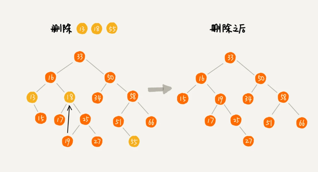

# 树的定义

    节点的度
        一个节点含有的子树的个数称为该节点的度

    叶节点
        度为 0 的节点称为叶节点

    分支节点
        度不为 0 的节点称为分支节点

    节点的层次
        从根节点开始，根节点的层次为 1 ，其直接后继层次为 2 ，以此类推

    节点的层序编号
        将树中的节点，按照从上层到下层，从左到右次序排成一个线性序列，把他们编成连续的自然数

    树的度
        树中所有节点的度的最大值

    树的深度（高度）
        树中节点的最大层次

# 二叉树

    二叉树
        度不超过 2 的树（每个节点最多有两个子节点）

    满二叉树
        除最后一层无任何子节点外，每一层上的所有节点都有两个子节点的二叉树

    完全二叉树
        深度为 h 的二叉树，除第 h 层外，其它各层 的节点数都达到最大个数，第 h 层所有的节点都连续集中在最左边，这就是完全二叉树

# 二叉树遍历

    先序遍历
        先访问根节点，然后先序遍历左子树，再先序遍历右子树
                          --------------
                                |
               这里是递归定义，拿到左子树，又开始访问根节点

    中序遍历
        从根节点开始（注意并不是先访问根节点），先中序遍历根结点的左子树，然后访问根结点，最后中序遍历右子树

    后序遍历
        从根节点开始（注意并不是先访问根节点），先后序遍历根结点的左子树，然后后序遍历根结点的右子树，最后访问根结点

# 二叉查找树（二叉排序树、二叉搜索树）

    特殊性
        二叉查找树要求，在树中的任意一个节点，其左子树中的每个节点的值，都要小于这个节点的值，而右子树节点的值都大于这个节点的值

    查找操作（较简单）
        先取根节点，如果它等于我们要查找的数据，那就返回
        如果要查找的数据比根节点的值小，那就在左子树中递归查找
        如果要查找的数据比根节点的值大，那就在右子树中递归查找

    插入操作（较简单）
        如果要插入的数据比节点的数据大，并且节点的右子树为空，就将新数据直接插到右子节点的位置
            如果不为空，就再递归遍历右子树，查找插入位置
        如果要插入的数据比节点数值小，并且节点的左子树为空，就将新数据插入到左子节点的位置
            如果不为空，就再递归遍历左子树，查找插入位置

    删除操作（复杂）
        删除操作较为复杂，分情况讨论

        1. 要删除的节点没有子节点
            只需要直接将父节点中，指向要删除节点的指针置为 null 即可

        2. 要删除的节点只有一个子节点（左或右子节点）
            1) 待删除节点的父节点指向待删除节点的子节点（也就是指针绕过待删除节点）
            2) 清空待删除节点指针

        3. 要删除的节点有两个子节点
            1) 需要找到这个节点的右子树中的最小节点（右子树的最小节点也比左子树最大值要大），把它替换到要删除的节点上
            2) 直接删掉这个最小节点（最小节点肯定没有左子节点，如果有，那么它就不是最小节点了）




# 二叉树最大深度问题

    利用递归算出一棵树的左右两个树高度，取最大值

    ```
    function maxDepth(node) {
        let max = 0;
        let maxLeft = 0;
        let maxRight = 0;

        if(node.left !== null) {
            maxLeft = maxDepth(node.left);
        }
        if(node.right !== null) {
            maxRight = maxDepth(node.right);
        }

        max = Math.max(maxLeft, maxRight);

        return max + 1;
    }
    ```
