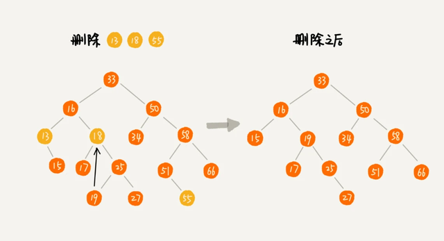

# 数据结构与算法概述

## 定义

我们如何把现实中大量而复杂的问题以特定的数据类型和特定的存储结构保存到主存储器 ( 内存 ) 中，以及在此基础上为实现某个功能 ( 比如查找某元素 ) 而执行的相应操作叫算法

## 衡量算法的标准

+ 时间复杂度

  大概程序要运行的次数，而非执行时间

+ 空间复杂度

  算法执行过程中大概所占的最大内存

+ 难易程度

+ 健壮性

# 预备知识

## 指针

就是地址

## 指针变量

就是存放内存单元的地址的变量

## 指针本质

指针的本质是一个操作受限的非负整数

对于 32 位电脑内存最大为 2^32 = 4GB ，地址编号是从 0 到 4G-1 的非负数

`int * p;` 不是定义了一个名为 *p 的变量，而是定义了一个存地址的变量，变量名为 p 类型为 int *

`*p` 如果 p 中存放了地址，那么 *p 可以理解为一个匿名变量 ( 以 p 的内容为地址的变量或表示 p 中的地址指向的变量 )

```c
int i = 0;
int * p = &i; // p 中存放了地址
*p = 10; // 相当于 i = 10
// 类似的有 a[0] 等同于 *(a+0)  // 以首地址为地址的变量即 a[0]
```

# 线性结构

## 分类

+ 连续存储（数组）
+ 离散存储（链表）

# 树

## 树的名词

+ 节点的度

  一个节点含有的子树的个数称为该节点的度

+ 叶节点

  子树个数为 0 的节点称为叶节点

+ 分支节点

  子树个数不为 0 的节点称为分支节点

+ 节点的层次

  从根节点开始，根节点的层次为 1 ，其直接后继层次为 2 ，以此类推

+ 节点的层序编号

  将树中的节点，按照从上层到下层，从左到右次序排成一个线性序列，把他们编成连续的自然数

+ 树的度

  树中所有节点的度的最大值

+ 树的深度（高度）

  树中节点的最大层次

## 二叉树

+ 二叉树

  度不超过 2 的树（每个节点最多有两个子节点）

+ 满二叉树

  除最后一层无任何子节点外，每一层上的所有节点都有两个子节点的二叉树

+ 完全二叉树 （完全二叉树包含满二叉树）

  深度为 h 的二叉树，除第 h 层外，其它各层 的节点数都达到最大个数，第 h 层所有的节点都连续集中在最左边，这就是完全二叉树

  简单说就是只删除了满二叉树最底层且最右边的连续若干个节点的树就是完全二叉树

## 二叉树的存储

+ 数组方式连续存储 （完全二叉树）

  - 优点（以完全二叉树方式来说）

    查找某个节点的父节点和子节点速度很快

  - 缺点（以完全二叉树方式来说）

    耗用内存较大

+ 链式存储

  将一个节点分为三部分，一部分存值，另外两部分存子节点的指针

  - 优点

    节省内存

## 一般树的存储

需要注意：一般树是没有顺序的，所以将其存储到线性结构后，无法再还原原本的树，如果想还原，那么需要将一般树转换成二叉树然后存储

+ 父亲表示法（双亲表示法）

  这种表示法是用线性数组存储的，数组中的每一个项（节点）分为两部分：一部分存值；另一部分存父节点的下标值

  特点：这种方式可以方便的查找节点的父节点

+ 孩子表示法

  这种表示法用线性数组存储，数组中的每一项（节点）分为两部分：一部分存储值；另一部分存储一个指针，指针指向节点的孩子组成的列表（孩子列表可以用链表存储）

  特点：这种方式可以方便的查找一个节点的所有子节点

+ 父亲孩子表示法

  这种方式结合了父亲表示法和孩子表示法，它用线性数组存储，数组中的每一项（节点）分为三部分：第一部分存值；第二部分存父节点下标值；第三部分存储一个指针，指向节点的孩子组成的列表

## 一般树转二叉树方法

转换过程：

- 节点的左指针指向它的第一个子节点
- 节点的右指针指向它的下一个子节点（子节点的兄弟节点）

## 二叉树遍历

    先序遍历
        先访问根节点；然后先序访问左子树，直到没有左子树；再先序访问右子树
        备注：先序访问左子树的意思是，把左子树当成一个新树，重新从这个新树的根节点开始访问
        例：
            A
           / \
          B   C
         / \   \
        D   E   F
        上述先序遍历先访问 A ，然后左子树是 BDE ，重新从 B 开始访问，然后左子树变为 D ，从 D 开始访问，以此类推
        结果为： A B D E C F
    
    中序遍历
        以根节点为分界，先中序访问左子树；然后访问根结点；最后中序访问右子树
        例：
            A
           / \
          B   C
           \   \
            E   F
        上述以 A 为分界，先访问左子树 BE ，重新以 B 为分界， 访问 B 的左子树，此时 B 的左子树为空，所以访问根节点 B ，然后访问 B 的右子树，以此类推
    	结果为： B E A C F
    
    后序遍历
        以根节点为分界，先后序访问左子树；然后后序访问右子树；最后访问根结点
        例：
            A
           / \
          B   C
           \   \
            E   F
        结果为： E B F C A

## 二叉查找树（二叉排序树、二叉搜索树）

    特殊性
        二叉查找树要求，在树中的任意一个节点，其左子树中的每个节点的值，都要小于这个节点的值，而右子树节点的值都大于这个节点的值
    
    查找操作（较简单）
        先取根节点，如果它等于我们要查找的数据，那就返回
        如果要查找的数据比根节点的值小，那就在左子树中递归查找
        如果要查找的数据比根节点的值大，那就在右子树中递归查找
    
    插入操作（较简单）
        如果要插入的数据比节点的数据大，并且节点的右子树为空，就将新数据直接插到右子节点的位置
            如果不为空，就再递归遍历右子树，查找插入位置
        如果要插入的数据比节点数值小，并且节点的左子树为空，就将新数据插入到左子节点的位置
            如果不为空，就再递归遍历左子树，查找插入位置
    
    删除操作（复杂）
        删除操作较为复杂，分情况讨论
    
        1. 要删除的节点没有子节点
            只需要直接将父节点中，指向要删除节点的指针置为 null 即可
    
        2. 要删除的节点只有一个子节点（左或右子节点）
            1) 待删除节点的父节点指向待删除节点的子节点（也就是指针绕过待删除节点）
            2) 清空待删除节点指针
    
        3. 要删除的节点有两个子节点
            1) 需要找到这个节点的右子树中的最小节点（右子树的最小节点也比左子树最大值要大），把它替换到要删除的节点上
            2) 直接删掉这个最小节点（最小节点肯定没有左子节点，如果有，那么它就不是最小节点了）



## 二叉树最大深度问题

利用递归算出一棵树的左右两个树高度，取最大值

```javascript
function maxDepth(node) {
    let max = 0;
    let maxLeft = 0;
    let maxRight = 0;

    if(node.left !== null) {
        maxLeft = maxDepth(node.left);
    }
    if(node.right !== null) {
        maxRight = maxDepth(node.right);
    }

    max = Math.max(maxLeft, maxRight);

    return max + 1;
}
```

# 串、数组和广义表

## 串

串是零个或多个任意 `字符` 组成的有限序列

#### 串的线性存储

###### 顺序存储结构（数组顺序串）


###### 链式存储结构（链串）

链式存储中需要 1 个字节存储数据，还需要 4 个字节（ 32 位系统 ）存储指针，指向下一个字符的地址，这样一个元素就需要 5 个字节来存储，存储密度较低。当然也可以进行优化，就是在一个节点中多存储几个数据，最后存一个指针，这样就提高了数据所占用的存储比例，这种方式叫块链

> 存储密度 = 数据所占用的存储 / 实际分配的存储
>
> 上述例子存储密度 = 1 / 5 = 0.2

块链结构

```c
// 节点
struct Chunk {
    char ch[80];
    struct Chunk * next;
}

// 字符串定义
struct String {
    Chunk * head;
    int length;
}
```

#### 串的模式匹配算法

目的式用来确定主串中所含子串（模式串）第一次出现的位置

###### BF (brute-force) 算法

算法的思想是：从主串的第一个字符开始与字串的字符进行匹配，匹配不到就从主串的下一个字符重新匹配字串

```javascript
function indexOfBF2(str, sub) {
    // 存储主串位置
    let i = 0;
    // 存储子串位置
    let j = 0;
    
    // 主串 或者 子串查找完就推出
    while(i < str.length && j < sub.length) {
        // 依次匹配主串和子串
        if(str[i] === sub[j]) {
            i++;
            j++;
        } else {
            // 主串回溯到下一个字符
            // 子串从头开始
            i = i - j + 1;
            j = 0;
        }
    }
    
    if(j >= sub.length) {
        // 主串当前位置减去子串长度就是匹配开始的位置
        return i - sub.length;
    }
    
    return -1
}
```


