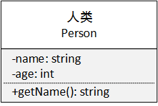
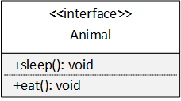
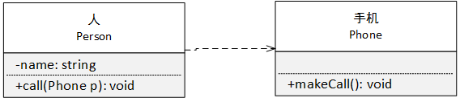
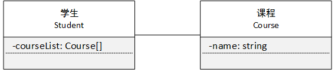
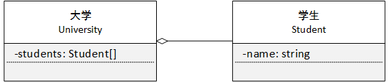
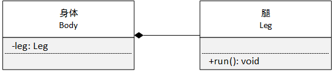
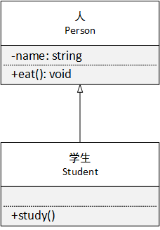
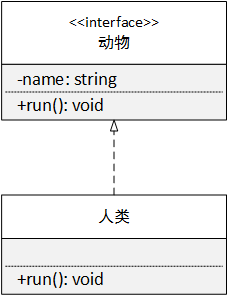

## 统一建模语言

【定义】统一建模语言（ Unified Modeling Language，UML ）是用来设计软件蓝图的可视化建模语言，是一种为面向对象系统产品进行说明、编制文档的语言


#### 类

在 UML 中类，类使用包含类名、属性和操作且带有分割线的矩形来表示

1. 类名是一个字符串
2. 属性即类的成员变量，格式为 `[可见性]属性名:类型[=默认值]` 例如 `-name: string = ''`

可见性表示如下：

```
公有 (Public) 使用 + 表示
私有 (Private) 使用 - 表示
受保护 (Protected) 使用 # 表示
```

3. 操作即类的成员方法，格式为 `[可见性]操作名(参数)[:返回值]` 例如 `+say(): void`




#### 接口

接口是一种特殊的类，它具有类的结构但不能被实例化，它不包含属性，质保函抽象操作，在 UML 中接口使用一个 `带有名称的圆` 或者使用 `<<interface>>` 表示




#### 类之间的关系

UML 中类个关系分为 6 中，并使用不同的图形来表示

###### 1 依赖关系

依赖关系是一种使用关系，它是对象之间耦合度最弱的一种关系，是临时性的关系

在 UML 中，依赖关系使用 `带箭头的虚线` 来表示，箭头从使用方指向被依赖方




###### 2 关联关系

关联关系是一种引用关系，表示一类对象与另一类对象之间的关系，关联关系可以使双向或者单向的

在 UML 中双向关联关系使用 `带两个箭头或者没有箭头的实线` 来表示，单向关联关系使用 `带一个箭头的实线` 来表示，箭头从使用方指向被关联方

实际中经常将一个类作为另一个类的成员变量来实现关联关系。




###### 2.1 界定依赖和关联关系

> 某个类以成员变量的形式出现在另一个类，是关联关系
>
> 某个类以局部变量或方法参数的形式出现在另一个类，是依赖关系


###### 3 聚合关系

聚合关系是 `关联关系` 的一种，是一种强关联关系，是整体与部分的关系，是 has-a 的关系

聚合关系中成员对象是整体对象的一部分，但是成员对象可以脱离整体对象而独立存在

在 UML 中，聚合关系可以用 `带空心菱形的实线` 来表示，菱形在整体一侧




###### 4 组合关系

组合关系也是 `关联关系` 的一种，是一种更强的聚合关系，是整体与部分的关系， 是 cxmtains-a 关系

组合关系中部分对象不能脱离整体对象而独立存在

在 UML 中，组合关系用 `带实心菱形的实线` 来表示，菱形在整体一侧




###### 5 泛化关系

泛化关系是 `耦合度最大` 的一种关系，表示一般与特殊的关系，是父类与子类的关系，是 is-a 的关系

在 UML 中，泛化关系使用 `带空心三角箭头的实线` 来表示，箭头从子类指向父类




###### 6 实现关系

实现关系是接口与实现类之间的关系

在 UML 中，实现关系使用 `带空心三角箭头的虚线` 来表示




