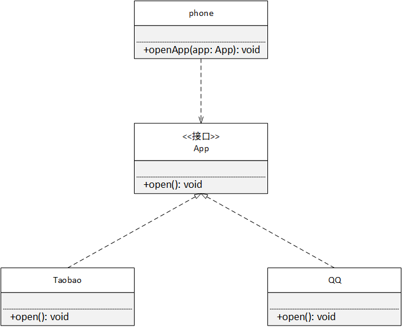

## 设计模式的重要性

软件工程中，设计模式是对软件设计中普遍存在（反复出现）的各种问题，所提出的解决方案。这个术语是由埃里希-伽马（ Erich Gamma ）等人在 20 世纪 90 年代从建筑设计领域引入到计算机科学的。

设计模式是用来解决特定问题的一系列套路，可以用来提高代码的复用性、扩展性和可靠性。

想象一下：

* 一个项目开发完成，客户提出了新功能（扩展性）
* 一个项目开发完成，原开发人员离职，怎么接手维护这个项目（可维护性、规范性）

哪里会用到设计模式

* 功能模块编写（算法数据结构 + 设计模式）
* 框架（设计模式）


## 设计模式七大原则

#### 设计模式目的

在实际工作中，程序员面临着来自耦合性、内聚性、可扩展性、重用性、灵活性等多方面的挑战。设计模式就是为了解决这些问题。

1. 复用性提高

    相同功能的代码不需要编写多次

2. 规范性提高

    规范的代码可读性更高，便于其他人阅读和理解

3. 可扩展性提高

    当需要增加新功能时非常方便，具有较高的可维护性

4. 可靠性提高

    新功能的变更不会导致旧功能出现异常

5. 程序对外呈现高内聚、低耦合

#### 设计模式为什么那样设计

设计模式也是有其设计依据的，主要有七大原则

1. 单一职责原则
2. 接口隔离原则
3. 依赖倒转原则
4. 里氏替换原则
5. 开闭原则
6. 迪米特原则
7. 合成复用原则

#### 1. 单一职责原则

【定义】职责指类发生变化的原因，单一职责原则规定一个类应该只有一个使其发生变化的原因（一个类应该只有一个职责，这个职责才会使该类变化）。

如果一个类 A 负责两个职责：职责 1 和职责 2 ，那么当职责 1 需求变更而需要改变 A 类时，就可能造成对职责 2 的影响。单一职责原则中应该将不同职责分到不同的类实现。

【例】实现一个提示弹框

```react
class Dialog extends React.Component {
    show(msg: string) {
        return (
            <div>
                <div>{msg}</div>
                <footer>
                    <button>确定</button>
                </footer>
            </div>
        );
    }
}

// 两种使用场景
class Page extends React.Component {
    // 想提示一条信息
    ReactDom.render(<Dialog msg="提交成功" />, document.body);

    // 想给用户选择 需要对类进行修改 修改可能会对原有功能形成影响
    ReactDom.render(<Dialog msg="您确定删除该条数据吗？" />, document.body);
}
```

比如以兼容方式，将代码修改成了下面的方式，虽然满足了需求，但是对原有功能产生了潜在影响（需要看使用原功能的地方是否扔正常）

```react
// 另一种违反单一职责原则的情况
class Dialog extends React.Component {
    // 修改了业务逻辑
    show(msg: string) {
        const showCancel = this.props.showCancel;

        return (
            <div>
                <div>{msg}</div>
                <footer>
                    {showCancel ? <button>取消</button> : null}
                    <button>确定</button>
                </footer>
            </div>
        );
    }
}

// 测试代码
class Page extends React.Component {
    // 想提示一条信息
    ReactDom.render(<Dialog msg="您确定删除该条数据吗" showCancel={true} />, document.body);
}
```

根据单一职责原则进行代码修改

```react
// 采用类级别的分离
class Alert extends React.Component {
    show(msg: string) {
        return (
            <div>
                <div>{msg}</div>
                <footer>
                    <button>确定</button>
                </footer>
            </div>
        );
    }
}

class Confirm extends React.Component {
    show(msg: string) {
        return (
            <div>
                <div>{msg}</div>
                <footer>
                    <button>取消</button>
                    <button>确定</button>
                </footer>
            </div>
        );
    }
}

// 测试代码
class Page extends React.Component {
    // 想提示一条信息
    ReactDom.render(<Alert msg="提交成功" />, document.body);

    // 想给用户选择
    ReactDom.render(<Confirm msg="您确定删除该条数据吗？" />, document.body);
}
```

以上方案遵循了单一职责原则，但是在业务相对简单时，显得相对麻烦，可以将职责在方法级别进行拆分

```react
// 方法级别的单一职责原则
class Dialog extends React.Component {
    confirm(msg: string) {
        return (
            <div>
                <div>{msg}</div>
                <footer>
                    <button>取消</button>
                    <button>确定</button>
                </footer>
            </div>
        );
    }

    alert(msg: string) {
        return (
            <div>
                <div>{msg}</div>
                <footer>
                    <button>确定</button>
                </footer>
            </div>
        );
    }
}
```

单一职责优点：

1. 降低类的复杂度，一个类负责一个职责
2. 提高类的规范性和可扩展性
3. 降低需求变更引起的风险

需要注意的事项

通常情况下，应遵循单一职责原则，但在逻辑足够简单，类方法足够少的情况下，可以在方法级别保持单一职责原则


#### 2. 接口隔离原则

【定义】客户端不应该被迫依赖于它所不需要的方法；一个类对另一个类的依赖应该建立在最小的接口上。

【例】动物类

```typescript
interface Animal {
    eat(): void;
    swim(): void;
    fly(): void;
}

class Dog implements Animal {
    eat() {}
    swim() {}
    fly() {
        throw new Error('dog can not fly');
    }
}
class Bird implements Animal {
    eat() {}
    swim() {
        throw new Error('bird can not swim');
    }
    fly() {}
}
```

以上接口设计违反了接口隔离原则， `Dog` 并不会飞，但是由于从接口实现而来，也必须实现 `fly()` 方法，同理 `Bird` 并不会游泳，但是也必须要实现接口中的 `swim()` 方法

接口隔离要求接口要为最小单元，通过自由组合来实现具体功能

```typescript
interface Eatable {
    eat(): void;
}
interface Swimable {
    swim(): void;
}
interface Flyable {
    fly(): void;
}

class Dog implements Eatable, Swimable {
    eat() {}
    swim() {}
}
class Bird implements Eatable, Flyable {
    eat() {}
    fly() {}
}
```


#### 3. 依赖倒转原则（从依赖细节到依赖抽象）

【前提】在软件设计中，细节往往具有多变性，而抽象层则相对稳定，因此以抽象为基础搭建起来的架构要比以细节为基础搭建起来的架构要稳定得多。

【定义】高层模块不应该依赖低层模块，两者都应该依赖其抽象；抽象不应该依赖细节，细节应该依赖抽象。依赖倒转的核心思想是要面向抽象或接口编程，而不是面向实现编程。

【高层】：调用方为高层

【低层】：被调用方即服务提供方为低层

【例】手机上有很多可以被打开的 App ，设计一个使用手机的场景

```typescript
// 高层模块
class Phone {
    // 这里依赖了低层模块
    openTaobao(tb: Taobao): void {
        tb.open();
    }
    // 这里依赖了低层模块
    openQQ(qq: QQ): void {
        qq.open();
    }
}

// 服务提供方
// 低层模块
class Taobao {
    open(): void {}
}
class QQ {
    open(): void {}
}

// 测试代码
class Client {
    run() {
        const phone = new Phone();
        phone.openTaobao(new Taobao());
        phone.openQQ(new QQ());
    }
}
```

以上设计高层模块依赖了低层模块，表示为


按照依赖倒转原则优化代码，将低层模块 `Taobao QQ` 进行依赖抽象处理，将高层模块 `Phone` 也进行依赖抽象处理，



```typescript
interface App {
    open(): void;
}
// 低层模块进行依赖抽象处理 抽离出所有应用的共性 open 方法
class QQ implements App {
    open(): void {}
}
class Taobao implements App {
    open(): void {}
}

// 高层模块
class Phone() {
    // 此时是以来抽象 而不是依赖低层细节
    openApp(app: App) {
        app.open();
    }
}

// 测试代码
class Client {
    run() {
        const phone = new Phone();
        phone.openApp(new QQ());
        phone.openApp(new Taobao());
    }
}
```


#### 4. 里氏替换原则

【定义】继承必须确保超类所拥有的特性在子类中依然成立（Robert Martin 解读：在程序中，基类对象可以被其派生类对象替代 ）

可以理解为：只要有父类出现的地方，都可以使用子类来替代

由于父类可以替换成子类，那么就要求子类只能扩展父类的功能，而不能修改父类的功能

如果业务逻辑不能保证不修改父类功能，那就应该考虑取消继承关系，可以考虑合成复用原则

#### 5. 合成复用原则

【定义】合成复用原则又叫组合/聚合复用原则，它要求在软件复用时，尽量先使用 `组合或者聚合（关联关系）` 等方式实现，其次才考虑使用继承，使用继承时还需考虑里氏替换原则

【例如】用户卡片需要获取用户信息

左图使用继承方式调用父类方法获取用户信息，由于两者逻辑上并不是 is-a 的关系，所以使用继承实属牵强

右图采用聚合关系调用类的方法获取用户信息


#### 6. 迪米特原则

【定义】迪米特原则又叫最少知识原则，一个对象应该对其他对象了解的尽可能少。只与你的直接朋友交谈。不要跟“陌生人”说话。

其含义是，如果两个软件实体无需直接通信，那么就不应该发生直接的相互调用，可以通过关联关系（直接朋友）转发该调用，其目的是降低类之间的耦合度，提高模块间的独立性。

【朋友】：当前对象的成员变量、当前对象创建的对象、当前对象的方法参数

【陌生人】：以局部变量方式出现的依赖对象，比如局部变量的值是通过朋友得到的另一个对象的引用

【例】用户关闭电脑

```typescript
class Computer {
    saveData() {}
    killProcess() {}
    powerOff() {}
}
class Person {
    computer = new Computer();
    
    // 这里违反了迪米特法则
    // 用户对电脑关闭的细节知道的太多了 很可能出现问题
    // 比如必须先保存数据 再关闭进程
    // 但用户可能会将顺序搞混
    shutDownComputer() {
        this.computer.saveData();
        this.computer.killProcess();
        this.computer.powerOff();
    }
}
```

按照迪米特法则修改

```typescript
class Computer {
    // 定义为私有 对外界隐藏
    private saveData() {}
    private killProcess() {}
    private powerOff() {}
    
    // 对外暴露接口
    public shutDown() {
        this.saveData();
        this.killProcess();
        this.powerOff();
    }
}
class Person {
    computer = new Computer();
    shutDownComputer() {
        this.computer.shutDown();
    }
}
```


#### 7. 开闭原则

【定义】软件实体应当对扩展开放，对修改关闭。开闭原则是编程中 `最基础最重要` 的原则。

开闭原则要求设计的软件，在需求变化时，可以通过扩展软件实体的行为来实现需求，而不是修改软件实体源码

编程中遵循的其他原则，以及使用设计模式的目的核心是开闭原则

【例】实现一个汽车类

```typescript
class Car {
    private name: string;
    private price: number;
    
    getPrice(): number {
        return this.price;
    }
}
```

以上代码实现了汽车获取价格功能。

如果需求变化，需要对汽车加个做打折处理，如果按照违反开闭原则方式修改

```typescript
class Car {
    private name: string;
    private price: number;
    // 修改源码方式实现了打折
    // 这样看似实现了功能，但是如果获取价格的方法被其他模块依赖
    // 那么这个修改可能会对依赖它的模块造成无法预计的影响
    getPrice() {
        return this.price * 0.8;
    }
}
```

按照开闭原则修改代码

```typescript
class Car {
    private name: string;
    private price: number
    // 源代码不做修改
    getPrice() {
        return this.price;
    }
}
// 通过扩展软件实体的行为实现需求
class DiscountCar extends Car {
    getPrice() {
        return super.getPrice() * 0.8;
    }
}
```


