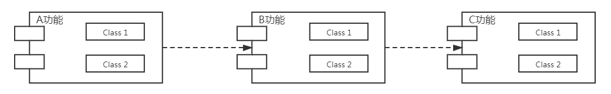

## 上节回顾

#### 1 UML

###### 1.1 依赖关系

依赖关系是一种使用关系，它是对象之间耦合度最弱的一种关系

###### 1.2 关联关系

关联关系是一种引用关系，表示一类对象与另一类对象之间的关系，包含：聚合关系、组合关系

###### 1.3 泛化和实现关系


#### 2 设计模式原则

###### 2.1 单一职责原则

一个类应该只有一个发生变化的原因（一个类只实现一个功能）

【补充】方法设计中，应保证所有语句都处于同一抽象层级上

###### 2.2 接口隔离原则

客户端不应该被迫依赖于它所不需要的方法（面向接口编程）

【例】动物行为

###### 2.3 依赖倒转原则

高层模块不应该依赖低层模块，两者都应该依赖其抽（面向抽象编程）

【例】手机打开应用

###### 2.4 里氏替换原则

讨论了关于继承的问题，子类尽量不要重写父类的方法，在适当情况下可以使用 `关联或者依赖` 来解决问题

###### 2.5 开闭原则

对扩展开放，对修改关闭（软件在需求变化时，可以通过扩展软件实体来实现需求，而不是修改使用方代码）

###### 2.6 迪米特原则

又叫最少知道原则，一个对象应该对其他对象了解的尽可能少

【例】人关电脑

###### 2.7 合成复用原则

在软件复用时，使用依赖或者关联关系来实现


## 补充：面向接口编程



面向接口编程示意图

1. 上层模块只需要知道下层模块对外的接口即可，至于细节不需要也不应该知道（迪米特原则）
2. 各个模块负责自己的职责（单一职责）
3. 每个模块应该“**承诺**”对外暴露的接口是不变的，当模块内部变化时，其他模块不需要知道，这就是依赖抽象而不依赖实现（依赖倒置原则）


## 单例模式

【定义】一个类只有一个实例，且该类能够自行创建类的实例的一种模式

【特点】

1. 只有一个实例
2. 单例对象由自身创建

【优点】

1. 减少内存开销
2. 资源共享

【例】实际工作中常使用事件机制来在组件间传递数据，这里就是使用的单例模式

```typescript
// 单例模式基本结构
class MyEvent {
    private static instance: MyEvent | null = null;

    private constructor() {}

    public static getInstance() {
        if(null === MyEvent.instance) {
            MyEvent.instance = new MyEvent();
        }

        return MyEvent.instance;
    }
}
```


## 工厂模式概述

【定义】任何可以产生对象的方法和类，都可以称之为工厂，单例也可以看成工厂（静态工厂或者叫简单工厂）

【补充概念】

1. 产品（或叫具体产品）

    类

2. 抽象产品

    抽象类、接口

3. 产品簇

4. 产品等级

【补充概念 2】

1. 作者（编写库和框架的人）

2. 用户（使用库和框架的人）

3. 接口（设计模式中的接口不专指 interface 只要下层给上层暴露的东西，都称为接口）


## 简单工厂模式（静态工厂）

简单工厂中创建实例的方法一般为静态方法（ static ），所以简单工厂也叫静态工厂

【例】食物类

```typescript
// 某作者 N 年前写了一个类
// 抽象产品
interface Food {
    eat(): void;
}
// 具体产品
class Hamburger implements Food {
    eat() {
        console.log('吃汉堡');
    }
}
class Rice implements Food {
    eat() {
        console.log('吃米饭');
    }
}
```

```typescript
// 用户使用
const f: Food = new Hamburger();
f.eat();
```

【问题】

不符合面向接口变成范式，用户依赖了细节，只要库代码类名发生变化，用户代码也需要修改。代码高耦合，且不符合迪米特原则

【使用简单工厂重构】

```typescript
// 定义工厂获取食物
class FoodFactory {
    static FOOD_TYPE_HAMBERGUR = 1;
    static FOOD_TYPE_RICE = 2;

    static getFood(type: number): Food | null {
        let food: Food | null = null;
        switch(type) {
            case FoodFactory.FOOD_TYPE_HAMBERGUR:
                food = new Hamburger();
                break;
            case FoodFactory.FOOD_TYPE_RICE:
                food = new Rice();
                break;
            default:
                break;
        }

        return food;
    }
}
```

```typescript
// 使用
const f = FoodFactory.getFood(FoodFactory.FOOD_TYPE_HAMBERGUR);
f.eat();
```

【简单工厂优点】

使用方无需知道产品细节

【简单工厂缺点】

1. 如果产品很多，那工厂就会变得很臃肿

2. 无法扩展新产品

    如果要扩展就得修改源代码，但可能源代码不是你写的，你没发修改

    即便代码是你写的，也不应该修改，因为修改违反开闭原则


【推论】

如果你的代码是给别人用的，那一定要问自己几个问题

1. 代码能够应对**可遇见**的变化
2. 代码扩展性怎么样


## 工厂方法模式

#### 工厂方法模式涉及角色

1. 抽象产品

    定义产品的规范

2. 具体产品

    实现抽象产品定义的规范

3. 抽象工厂

    定义创建产品的接口

4. 具体工厂

    实现抽象工厂接口，完成产品创建


【例】仍然是食物类

```typescript
// 抽象产品
interface Food {
    eat(): void;
}
// 具体产品
class Hamburger implements Food {
    eat() {
        console.log('吃汉堡');
    }
}
class Rice implements Food {
    eat() {
        console.log('吃米饭');
    }
}

// 抽象工厂
interface FoodFactory {
    getFood(): Food;
}
// 具体工厂
class HamburgerFactory implements FoodFactory {
    getFood(): Food {
        return new Hamburger();
    }
}
class RiceFactory implements FoodFactory {
    getFood(): Food {
        return new Rice();
    }
}
```

```typescript
// 使用
const factory = new HamburgerFactory();
const f = factory.getFood();
f.eat();
```

【工厂方法模式优点】

1. 拥有简单工厂的优点（使用方无需知道产品细节）
2. 可以扩展新产品

【扩展新产品】

```typescript
class Soup implements Food {
    eat() {
        console.log('喝汤');
    }
}
class SoupFactory implements FoodFactory {
    getFood(): Food {
        return new Soup();
    }
}
```


#### 抬杠环节

###### 1. 已知简单工厂和工厂方法使用时都无需知道产品的具体细节，但是反观工厂方法模式使用时的代码，其具体依赖了工厂方法名字，如果作者修改了工厂的方法名，那使用者也需要修改！感觉又回到了原点

> 解释参考上面面向接口编程第 3 点以及工厂模式补充概念 2

###### 2. 既然 `Soup` 类是我们自己创建出来的，直接使用不就得了，为什么还要弄一个工厂

> 解释：美食节例子