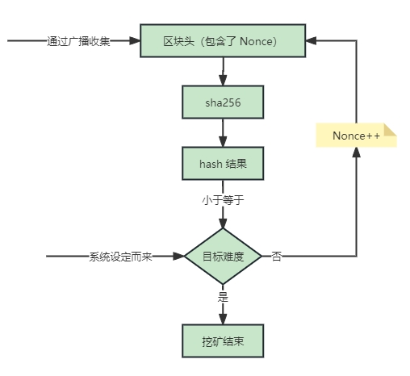
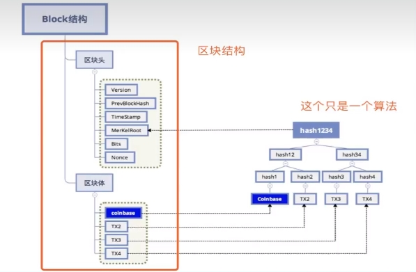

# 比特币

## 钱包

比特币钱包有 N 个公钥（公钥对应收款地址，公钥里有特殊字符，所以实际地址是公钥转换了一下得来的），每个地址都有自己的私钥，wallet.dat 是私钥的集合

每次接收转账比特币钱包都会生成新的地址和私钥，达到隐藏自己资产的目的

wallet.dat 会自动帮我们维护地址和私钥对儿，所以给别人转账不需要手动自己选择一个地址作为转出方

## 比特币转账

比特币没有总账户的概念，每个人的可用资金是所有其他人给你转账的记录的总合

其他人给你的转账对你来说叫做输入，对其他人来说叫做输出

其他人给你转账时会使用你的公钥锁定这个输出，所以对你来说你就拥有了对这个输出的使用权

所以比特币中有个概念 UTXO (unspent transaction output) 代表了未使用的输出，如果这些输出都是给你的，那么这些输出的数值加起来就是你的总资金

在比特币转账时需要从你拥有的这些个 utxo 中挑选一个金额比较合适的进行转账，剩余的部分还需要转给你，当作你的一个新的 utxo 。比如你要转给 Tom 0.8btc ，你使用一个 1btc 的地址进行转账，你除了需要给 Tom 转 0.8 个外，还需要给自己账户再转 0.2 个，这个 0.2 的输出会成为你新的输入供下次使用，如果没有这一步，相当于你的钱就没了

## 比特币挖矿过程

挖矿其实就是找满足条件（ sha256 结果比系统设定的难度值小）的随机值的过程

## 比特币地址类型

+ Legacy (P2PKH) 格式 

  地址以「1」开头，是比特币最原始的地址格式，也是最常见的地址格式。 P2PKH 是 Pay To PubKey Hash 缩写

  ⽐如： 1Fh7ajXabJBpZPZw8bjD3QU4CuQ3pRty9u

+ Nested SegWit (P2SH) 格式（兼容隔离见证地址）

  地址以「3」开头，从这种格式我们无法区分它们到底是多重签名（ multisig ）地址还是隔离见证兼容地址。 P2SH 是 Pay To Script Hash 的缩写，它⽀持⽐ Legacy 地址更复杂的功能

  比如： 3KF9nXowQ4asSGxRRzeiTpDjMuwM2nypAN

+ Native SegWit (P2WPKH) 格式 （原生隔离见证地址），也称为 bech32

  地址以「bc1」开头，属于本地 SegWit 地址格式，专为 SegWit 而开发的地址格式。由于更多交易数据可以储存在单个区块，而 Bech32 格式地址本身与 SegWit 相容，不需要额外的空间来将 SegWit 地址放入 P2SH 地址，因此从这种地址发送比特币时的平均费用可能会较低

  Bech32 在 2017 年底在 BIP173 （ Bitcoin Improvement Proposal ，为比特币代码开发者所用 ）被定义，该格式的主要特点之一是它不区分大小写（ 地址中只包含 0-9, az ），因此在输入时可有效避免混淆且更加易读

  比如： bc1qq7g86nq8qnnwqa7cdwwjykp8cxcmfped50kxxf

+ Taproot

  地址以「bc1」开头，是 2021 年 11 月比特币的软分叉升级，它提高了比特币交易的匿名性

#### 什么是 SegWit ？

SegWit （隔离见证）是在比特币区块链上发生的软分叉（ Soft Fork ），是在 2015 年比特币社区为了解决区块链网络面临的可扩展性和交易延展性问题而开发的升级协议，在 2017 年 8 月正式实行，它的中心思想是重新组织区块数据，使签名不再与交易数据存储在一起，从而能够将更多交易存储在单个区块中来增加网络的交易吞吐量

## 比特币公钥转换成收钱地址过程

version 部分是为了区分不同的网络，如测试网 和 正式网

正式网版本号为： 0x00

测试网版本号为： 0x6F

> 以太坊地址生成和比特币不同，以太坊地址是十六进制数字，是从公钥 Keccak-256 哈希的最后 20 个字节派生的标识符

## 比特币区块

一个区块中有多个交易，每个交易都有一个唯一的交易 ID （挖矿交易也有交易 ID ），每个交易中可能会有多个输入 ( input ) 和多个输出 ( output )

默认交易列表的第一个交易就是挖矿交易

#### 区块结构

| 字段           | 占用字节数 | 说明                                     |
| -------------- | ---------- | ---------------------------------------- |
| 区块大小       | 4          | 用字节表示该字段之后的区块大小           |
| 区块头         | 80         |                                          |
| 交易计数器     | 1-9        | 该区块包含的交易数量，包含 coinbase 交易 |
| 区块体（交易） | 不定       | 记录在区块里的交易信息                   |

#### 区块头 (Block Header)

| 字段         | 占用字节数 | 说明                                                         |
| ------------ | ---------- | ------------------------------------------------------------ |
| 版本         | 4          | 区块版本号，表示本区块遵守的验证规则                         |
| 父区块头哈希 | 32         | 前一个区块的哈希值，由 sha256( sha256(父区块头) ) 计算得出   |
| Merkle 根    | 32         | 该区块中交易的 Merkle 树根的哈希值，由 sha256( sha256(树根) ) 计算得出 |
| 时间戳       | 4          | 该区块产生的近似时间，精确到秒                               |
| 难度值       | 4          | 该区块需要的工作量证明的目标难度值（参考挖矿过程）           |
| Nonce        | 4          | 基于区块的难度值，算出来的满足条件的随机数（参考挖矿过程）   |

> 注意：
>
> 区块本身只会存储前一个区块的 hash ，本区块的 hash 不会存储
>
> 节点在接收到区块后会在本地自己计算区块的 hash 。这样做是为了方便索引区块便于查找，避免查找某个区块时遍历操作

#### 区块体 (Transactions)

存储了交易列表

###### 交易分类

+ 挖矿交易

  区块的第一条交易，是奖励矿工的交易，它没有输入，只有输出

+ 普通交易

  交易包含了收款方、付款方、金额、手续费

  普通交易至少包含一个输入（钱的来源）和至少一个输出（付款给谁和必要时的找零）

## 比特币转账过程

张三给李四赚钱需要有如下过程：

+ 根据交易 id 找到对应的交易，该交易的多个 output 中有一个是张三的地址，并且由张三的锁定脚本进行了锁定
+ 提供一个索引值，以便确定多个 output 中哪一个是张三的
+ 张三提供一个解锁脚本，解锁对应的 output ，然后张三就可以花这笔钱了

# 以太坊

## Provider

当我们想要与区块链上的数据和代码进行交互时，我们只需要找其中一个节点进行交互，因为任何节点都可以广播将要在 EVM 上执行的事务的请求

与区块链交互时连接的节点（无论是自己部署的还是使用来自第三方服务的现有节点）通常被称为 "Provider" ，比如小狐狸钱包就是一个 provider

自己存储以太坊区块信息可以使自己成为一个 provider ，但存储完整的以太坊区块链成本很高，所以一般选择第三方节点服务（ provider ）

## 以太坊账户类型

#### 外部账户

普通账户，所有以太坊的交易都由外部账户发起，它没有关联代码。使用用户私钥进行控制

#### 合约账户

内部账户，有关联代码

#### 交易和消息

交易是外部账户发起的，会打包区块上链；消息是合约之间进行的调用

## 公钥与私钥

私钥经过某种计算可以推导出公钥，但是公钥没办法推导出私钥

#### 公钥加密场景

公钥加密用于给特定人发消息，用接收方的公钥将信息加密，只有接收方有自己的私钥，可以解密消息，其他人无法解密消息

#### 私钥签名场景

私钥签名用于证明消息是自己发的，用自己的私钥将信息加密，所有人都可以用我的公钥将信息解密

#### 实际签名过程

#### 发送文件场景

1. A 用户根据文件数据算出一个 hash ，并将算出的 hash 用自己的 `私钥` 加密得到签名 sign
2. A 将源文件和签名 sign 一块发给对方 B
3. B 得到一个签名 sign 和一个源文件
4. B 把得到的 sign 用发 A 的公钥解密得到一个 hash2 值
5. B 把源文件算出 hash3
6. 如果 hash2 === hash3 那么文件是 A 发送的（因为用 A 的公钥可以解密出哈希），且没有被篡改

#### 区块链转账场景

1. 付款方用自己的私钥对交易数据（包含了付款地址、收款地址、金额等信息）算出的 hash 值进行加密，得到签名数据

2. 广播自己的交易给矿工

   类似于：我支付了 10 eth 到 0x12345678 地址，签名信息是 abcdefg...，大家来验证一下把

   广播的时候把自己产生 `交易数据` 和 `签名数据` 要一并广播出去给矿工

3. 验证

   矿工得到 交易数据 和 签名数据

   矿工用付款人的公钥（公钥从哪里来还没搞清）可以对签名数据进行解密，得到一个 hash1

   矿工对交易数据进行计算得到一个 hash2 值，如果 hash1 === hash2 那么交易合法

# 跨链桥

存在两种跨链桥：任意消息跨链桥（Arbitrary Message Briage，AMB）和资产跨链桥。其中，资产跨链桥又分为封装代币桥（Wrap 桥）和流动性兑换桥（Swap 桥）。本报告重点阐述资产跨链桥

