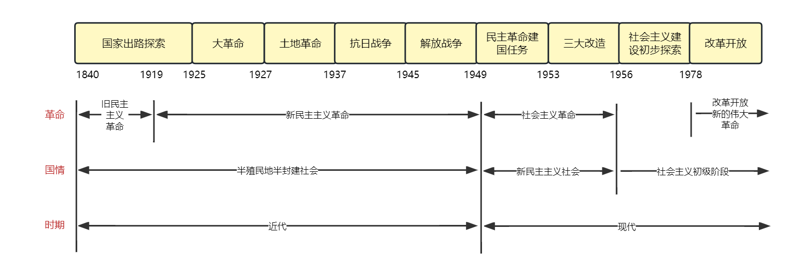

## 整体框架

近代中国的主要矛盾和历史任务

**国情决定矛盾，矛盾决定任务，任务决定道路**

|      | 国情             | 主要矛盾                                             | 主要任务                                         | 道路                       |
| ---- | ---------------- | ---------------------------------------------------- | ------------------------------------------------ | -------------------------- |
| 近代 | 半殖民地半封建   | 帝国主义同中华民族的矛盾 封建主义和人民大众的矛盾 | 争取民族独立（反帝）、人民解放（反封建）         | 农村包围城市，武装夺取政权 |
| 现代 | 社会主义初级阶段 | 人民日益增长的物质文化需要同落后的社会生产之间的矛盾 | 解放生产力，发展生产力 实现国家富强、人民富裕 | 中国特色社会主义道路       |

## 章节

#### 近代史

###### 1. 反对外国侵略的斗争

###### 2. 对国家出路的早期探索

###### 3. 辛亥革命

###### 4. 开天辟地大事变

###### 5. 中国革命的新道路

###### 6. 中华民族抗日战争

###### 7. 为创建新中国而奋斗

#### 现代史

###### 8. 社会主义基本制度的全面确立

###### 9. 社会主义建设在探索中曲折发展

###### 10. 改革开放与现代化建设新时期

###### 11. 中国特色社会主义进入新时代

## 鸦片战争前的中国 

经济：小农经济，封建地主土地所有制经济占主导地位

政治：高度中央集权的封建君主专制制度

文化：儒家思想为主

社会：族权和政权相结合的封建宗法等级制度，核心是宗族家长制

主要矛盾：地主阶级与农民阶级的矛盾

## 第一章 反对外国侵略的斗争

#### 1.2 帝国主义对中国的侵略及近代中国社会的演变

中国半殖民地半封建社会的主要特征

1. 资本-帝国主义侵略势力日益成为支配中国的决定性力量
2. 中国的封建势力日益衰败并同外国侵略势力勾结，成为帝国主义压迫中国人民的统治支柱
3. 封建地主土地所有制依然在广大地区保持
4. 新兴民族资本主义已经产生，但发展缓慢，力量薄弱
5. 经济、政治和文化发展极不平衡
6. 广大人民，尤其是农民日益贫困化

#### 1.3 抵御外来侵略争取民族独立的斗争

列强瓜分中国图谋破产原因

1. 帝国主义列强之间的矛盾是一个重要原因
2. 根本原因是，中华民族进行了不屈不挠的反侵略斗争

反侵略斗争失败的原因

1. 根本原因是社会制度的腐败
2. 经济技术的落后是一个重要原因
